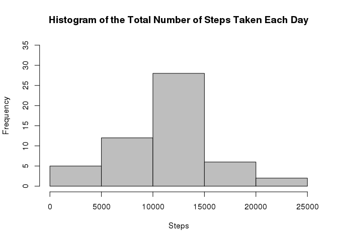
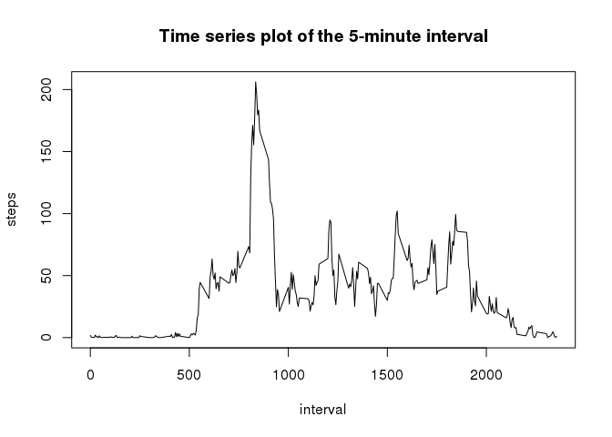
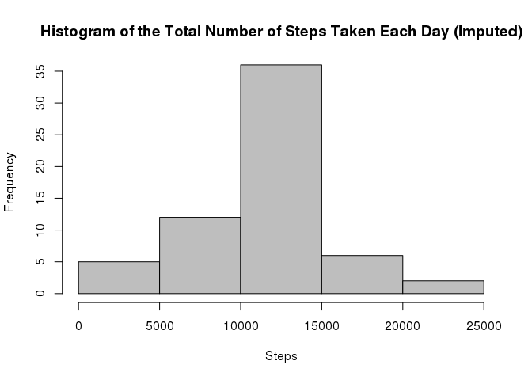
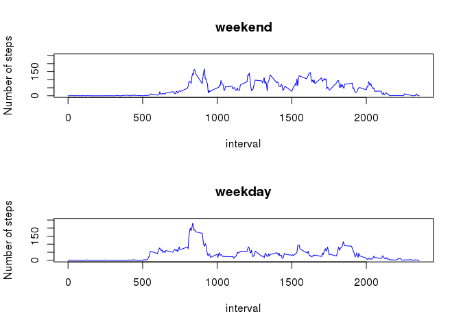

# Reproducible Research: Peer Assessment 1


```r
library(dplyr)
```

```
## 
## Attaching package: 'dplyr'
## 
## The following object is masked from 'package:stats':
## 
##     filter
## 
## The following objects are masked from 'package:base':
## 
##     intersect, setdiff, setequal, union
```

```r
library(ggplot2)

setwd("~/work/RepData_PeerAssessment1")
```

## Loading and preprocessing the data code

```r
##1. Load the data
if(! file.exists("activity.csv")){
    unzip("activity.zip")
}
data<-read.csv("activity.csv", na.strings = "NA")

##2. Process/transform the data into a format suitable for analysis
data <- mutate(data, date = as.POSIXct(strptime(date,"%Y-%m-%d")))
```
        
```  
```  
  
  
## What is mean total number of steps taken per day?


```r
##1. Calculate the total number of steps taken per day

stepsPerDay <- split(data$steps,data$date) %>% sapply(sum)

##2. Make a histogram of the total number of steps taken each day

hist(stepsPerDay, 
     col="grey",
     breaks=5,
     main="Histogram of the Total Number of Steps Taken Each Day", 
     xlab="Steps",
     ylim=c(0,35))
```

 

```r
##3. Calculate and report the mean and median of the total number of steps taken per day
res <- summary(stepsPerDay)
```

####The mean total number of steps per day is 1.077\times 10^{4}.
####The median total number of steps per day is 1.076\times 10^{4}.       
        
```  
```  

        
## What is the average daily activity pattern?

```r
##1. Make a time series plot (i.e. type = "l") of the 5-minute interval (x-axis) and the average number of steps taken, averaged across all days (y-axis)
steps5min <- split(data$steps,data$interval) %>% sapply(mean, na.rm=TRUE)
plot(x=names(steps5min), steps5min, 
     type="l", 
     main="Time series plot of the 5-minute interval",
     xlab="interval", 
     ylab="steps")
```

 


```r
##2. Which 5-minute interval, on average across all the days in the dataset, contains the maximum number of steps?
##names(steps5min[steps5min==max(steps5min)])
```
####835-th 5-minute interval contains the maximum number of steps.
```  
```  
  


## Imputing missing values

```r
##1. Calculate and report the total number of missing values in the dataset
##sum(is.na(data$steps))
```
####There are 2304 rows with missing values.
```  
```  

####Devise a strategy for filling in all of the missing values in the dataset: the mean for that 5-minute interval.


```r
##3. Create a new dataset that is equal to the original dataset but with the missing data filled in.
dataImp <- data 
dataImp[which(is.na(data$steps)),]$steps <- as.integer(round(steps5min[c(as.character(data[which(is.na(data$steps)),]$interval))]))
```


```r
##4 Make a histogram of the total number of steps taken each day and Calculate and report the mean and median total number of steps taken per day. Do these values differ from the estimates from the first part of the assignment? What is the impact of imputing missing data on the estimates of the total daily number of steps?

stepsPerDayImp <- split(dataImp$steps,dataImp$date) %>% sapply(sum)
hist(stepsPerDayImp, 
     col="grey",
     breaks=5,
     main="Histogram of the Total Number of Steps Taken Each Day (Imputed)", 
     xlab="Steps",
     ylim=c(0,35))
```

 

```r
resImp <- summary(stepsPerDayImp)
#meanPerDayImp <- resImp["Mean"]
#medianPerDayImp <- resImp["Median"]
```
####The mean tolal number of steps (for the imputed data set) per day is 1.077\times 10^{4}.
####The median tolal number of (steps for the imputed data set) per day is 1.076\times 10^{4}. 
####These values do not differ from the estimates for the first part of the assignment.
####Despite some changes in the data set and frequency distribution, there is no impact of imputing missing data.
####This might be a good criteria to for imputing strategy.  
```  
```  

      

## Are there differences in activity patterns between weekdays and weekends?

```r
##1. Create a new factor variable in the dataset with two levels – “weekday” and “weekend” indicating whether a given date is a weekday or weekend day.
dataImp <- mutate(dataImp, weekdays = as.factor(ifelse(format(date, format="%u")> "5", "weekend", "weekday")))

dataImpWeekdays <- filter(dataImp, weekdays == "weekday")
dataImpWeekends <- filter(dataImp, weekdays == "weekend")
```


```r
##2. Make a panel plot containing a time series plot (i.e. type = "l") of the 5-minute interval (x-axis) and the average number of steps taken, averaged across all weekday days or weekend days (y-axis).
steps5minWeekdays <- split(dataImpWeekdays$steps, dataImpWeekdays$interval) %>% sapply(mean, na.rm=TRUE)
steps5minWeekends <- split(dataImpWeekends$steps, dataImpWeekends$interval) %>% sapply(mean, na.rm=TRUE)

par(mfrow = c(2, 1))
plot(x=names(steps5minWeekends), steps5minWeekends, type="l", main="weekend", xlab="interval", ylab="Number of steps", col="blue", ylim=c(0,250))
plot(x=names(steps5minWeekdays), steps5minWeekdays, type="l", main="weekday", xlab="interval", ylab="Number of steps", col="blue", ylim=c(0,250))
```

 

####Beginning (up to interval #500) of weekend and weekday activity patterns looks similar. We do not expect too much activities at night.
####There is a huge spike in the morning weekday followed by three-four smaller spikes. Weekend "day" (activity) starts and ends bit later than during weekdays.
####We do not observe high spikes during the weekend.


```  
```  
